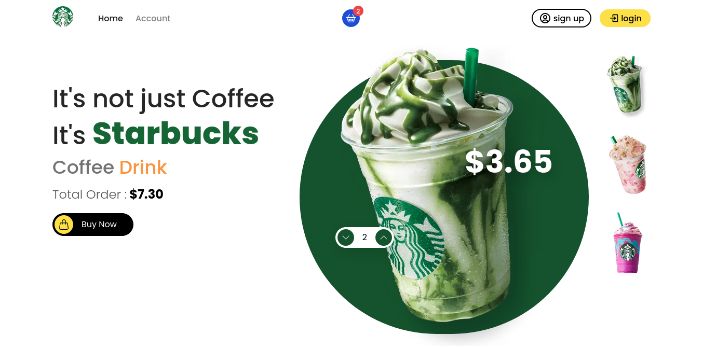

# Starbucks!

Starbucks full stack website made with Next Js for both front-end and back-end. 

## Table of contents
- [Overview](#overview)
	 - [Screenshot](#screenshot)
	- [Run Project](#run)
	 - [Links](#links)
- [My process](#my-process)
  - [Built with](#built-with)
  - [What I learned](#what-i-learned)
- [Author](#author)

## Overview
Front-end part includes home page where users can see drinks and add items to cart or remove items from cart. I have actually implemented storing cart items in local storage when user is not logged in and store items to their account when they are logged. The state is managed using redux toolkit. I have used stripe api for payment processing. Users can also go to account page where they can see the products they have bought till date.

I used next.js api for backend. Users can create or login to their account. I have used mongodb atlas for database.

### Screenshot

### Run
Clone the project

    git clone https://github.com/exxnnonymous/starbucks-landing-page.git
Build and start the app

    npm run build && npm start

### Links
- Live Site URL: (https://starbucks-eosin.vercel.app)

## My process

### Built with
- CSS modules and [Tailwind CSS](https://tailwindcss.com/) - For styling
- [React Icons](https://react-icons.github.io/react-icons/) - For icons
- [Redux toolkit](https://redux-toolkit.js.org/) - For state management
- [next-redux-wrapper](https://github.com/kirill-konshin/next-redux-wrapper) - For implementing redux in serverside
- [Next Js](https://nextjs.org/) - React Framework
- [Stripe](https://stripe.com/) - For payment
- MongoDB and Mongoose for Database
- Axios to fetch data, bcrypt for hashing user password and implemented jsonwebtoken and cookie for secure user authentication.

### What I learned

I learned a lot while building this website. I learned a lot about state management. I learned to use redux toolkit and also to implement it in serverside using [next-redux-wrapper](https://github.com/kirill-konshin/next-redux-wrapper). I learned to use stripe api, create stripe checkout session and more about it. I learned more about user authentication and to make website secure implementing jsonwebtoken and cookie. I learned to manage the state using Context API and useReducer Hooks. I also learned a lot on CRUD while creating, logging in user, updating cart items, and updating products users have bought.

## Author

- Twitter - [@exxnnonymous](https://www.twitter.com/exxnnonymous)
- LinkedIn - [Sulav Bista](https://www.linkedin.com/in/sulav-bista-208562236/)